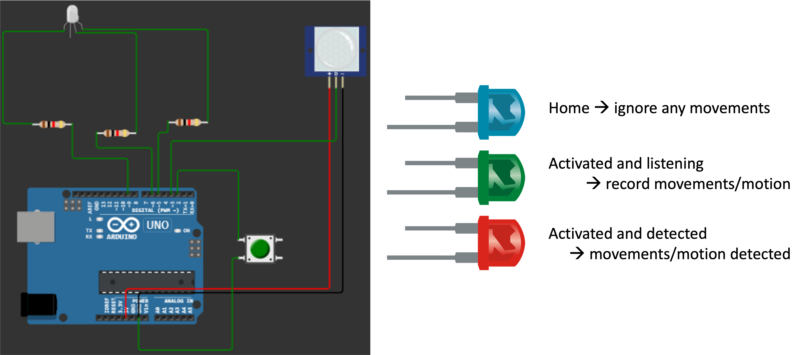
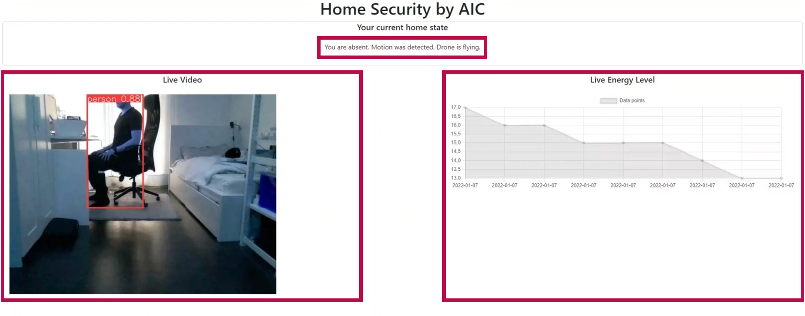
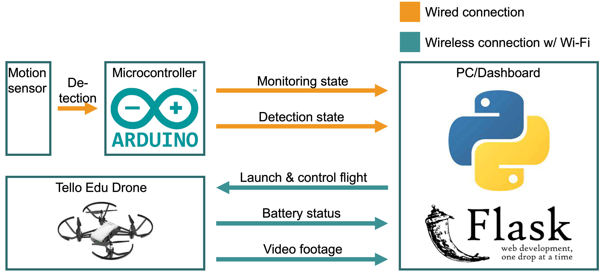

# Drone Security (AIC)

> *Disclaimer* Please note that the code and contributions in this GitHub repository were created through a collaborative effort by [@Irish-77](https://github.com/Irish-77) and [@Ronho](https://github.com/Ronho). Both contributors acknowledge that their work is of equal merit and that they each have a deep understanding of the other's contributions.

The drone project, also called AIC Security, is a home security system that consists of a drone, a motion sensor, and an Arduino board. 

The motion sensor notifies the Arduino board about any detected movements. The Arduino board then checks whether the owner is at home by monitoring the respective button. The data is then sent to the PC, which determines whether the drone should be launched and whether a video stream should be transmitted. Independently of this, the drone permanently transmits its battery status. All the information is displayed in a dashboard that includes the drone's live video feed, a battery status graph, monitoring status and, if monitoring is enabled, detection status.

## Table of contents
1. [Installation](#installation)
    - [Frontend](#frontend)
    - [Server](#server)
    - [Arduino](#arduino)
1. [Description](#description)
    - [Dashboard](#dashboard)
    - [Architecture](#architecture)
1. [Further Reading Material](#further-reading-material)


## Installation

The system can be separated into two systems. First, the Arduino must be configured and started. Then the dashboard can be initiated.

First, clone this project.
```sh
git clone https://github.com/C2G-BR/Drone-Security.git
```

### Arduino
In order for the motion sensor to work and send the appropriate data, the Arduino board must be built. A blueprint for the respective [program code](src/detector/detector.ino) can be found below.
After the setup has been built, the program code must be written to the board.
Pay attention that the Arduino is always connected to the computer via USB, so that the communication functions properly.



### Dashboard

Setting up the dashboard is a bit more complicated.
Start by installing all required packages.

```sh
pip install -r requirements.txt
```

Next, we run main.py. 

```sh
python main.py
```

At the first start the program downloads the pre-trained Yolo model. Once the model is downloaded, terminate the server. 
At this point, the drone can be powered on. Then, connect the server to the wifi of the drone.

The setup is done so far. In the final step, the server can be rebooted.
```sh
python main.py
```
As of now, the security system is enabled, the drone is available and controllable, and the dashboard is active.


## Description

### Dashboard


### Architecture


### Arduino
The Arduino board is connected to a button and an RGB-LED.
By default, the system considers that the owner is at home. Accordingly, the LED lights up blue. If the owner leaves the house, he activates the security mode by clicking the button. The LED then lights up green until movement is registered. In this case, the LED color then changes to red.

When the owner returns home, he can deactivate the security mode by pressing the button again. Movements are no longer detected.

The communication with the server/dashboard is done via a serial interface, where only the client, i.e. the Arduino board, writes.

## Further Reading Material
- [🇬🇧 Presentation of the project](docs/aic_security_presentation_english.pdf)
- [🇩🇪 Presentation of the project](docs/aic_security_presentation_german.pdf)
- [🇬🇧 Onepager of the project](docs/aic_security_onepager_english.pdf)
- [🇩🇪 Onepager of the project](docs/aic_security_onepager_german.pdf)
  
</hr>

[Go back to table of contents](#table-of-contents)